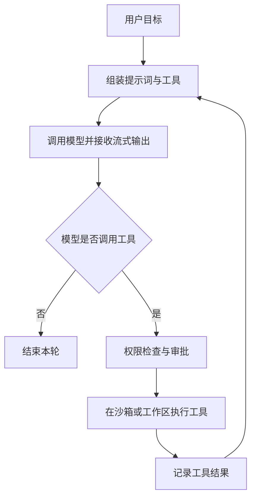
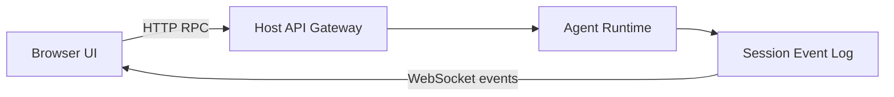
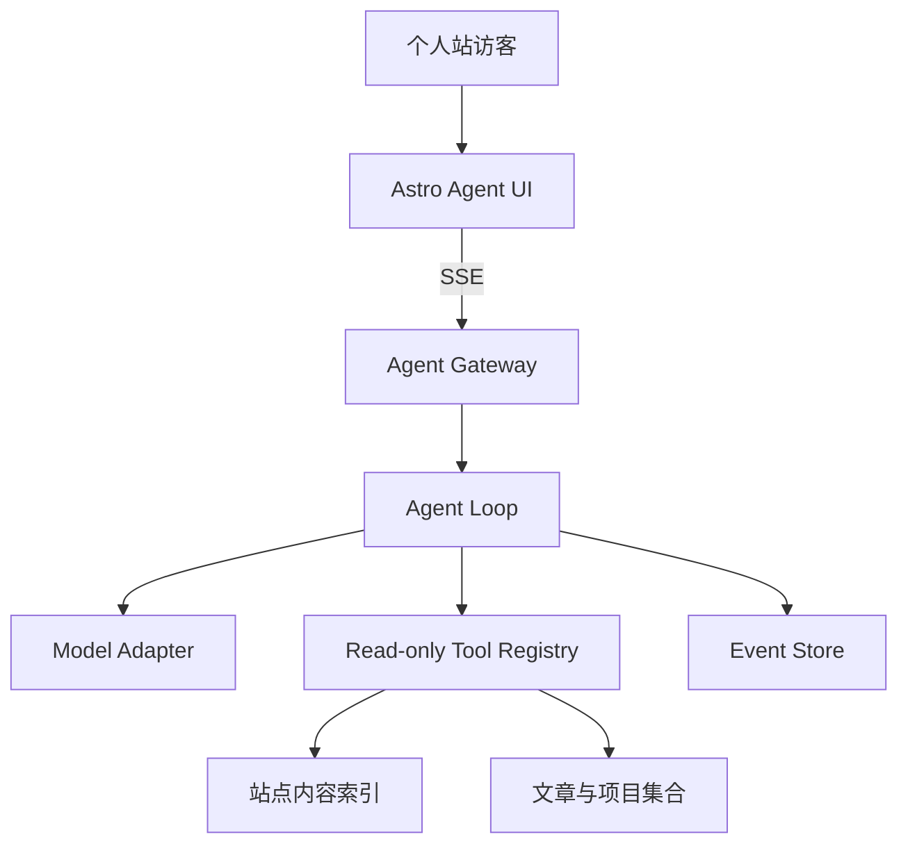

> 本文基于 [DeepSeek Harness 仓库](https://github.com/deepseek-ai/deepseek-harness)及其[架构文档](https://github.com/deepseek-ai/deepseek-harness/blob/master/docs/architecture.md)整理。项目目前仍处于 Developer Preview，接口和目录可能继续发生破坏性变化；本文重点讨论相对稳定的设计思想，而不是绑定某个版本的 API。

## 一、先给结论：它不是聊天网页，而是 Agent 的运行时

DeepSeek Harness 不是一个模型，也不只是套在 DeepSeek API 外面的聊天界面。更准确地说，它是一个开源的 **Agent 运行时、工具执行框架和编程工作台**，负责把模型的推理能力组织成可以持续执行、调用工具、记录状态并接受控制的任务系统。

可以用一句话理解它：

> **DeepSeek 模型是大脑，Harness 是大脑之外的身体、工具箱、记忆、权限系统和操作界面。**

普通聊天应用的主链路是：

```text
用户消息 → 调用模型 → 返回文本
```

Harness 的链路则是：



模型每次可以先读取文件、搜索代码或执行命令，再根据工具结果决定下一步。这个循环一直持续到模型给出最终回答、达到限制、被用户取消，或因错误而停止。

因此，真正值得研究的并不是“怎样调用 DeepSeek”，而是它怎样解决以下工程问题：

- 多步 Agent 循环如何推进和停止；
- 文件、Shell、搜索、Skill、子 Agent 等工具如何注册与执行；
- 高风险操作如何审批，进程和文件访问如何隔离；
- 长任务如何保存、恢复、回放和分叉；
- 模型、存储、沙箱与 UI 如何替换或扩展；
- 浏览器如何展示流式文字、工具卡片和实时任务状态。

## 二、DeepSeek Harness 提供了什么

### 1. 完整的 Agent Loop

Harness 把一次用户任务称为一个 **turn**，一个 turn 可以包含多个 **step**。每个 step 对应一次模型请求，以及这次请求产生的工具调用。

```text
turn/start
  step/start
    user/message
    assistant/chunk ...
    assistant/message
    tool/call ...
    tool/result ...
  step/end
  下一次 step，或结束
turn/end
```

若模型没有请求工具，当前 turn 可以结束；若产生了工具调用，结果会重新进入上下文，再触发下一个 step。Harness 还要处理取消、重试、超时、模型错误、中途追加消息和恢复执行等情况。

### 2. 一组可组合的编程能力

仓库包含或预留了较完整的 Agent 能力：

| 能力              | 作用                           |
| ----------------- | ------------------------------ |
| Filesystem        | 读取、搜索和修改工作区文件     |
| Bash / PowerShell | 执行命令与构建、测试流程       |
| Sandbox           | 限制进程、目录与资源访问范围   |
| Approval          | 在危险操作前请求用户确认       |
| Skills            | 按任务动态加载专业指令与工作流 |
| Subagent          | 把独立任务委派给其他 Agent     |
| Jobs / Workflow   | 管理后台任务和多步骤流程       |
| Plan / Goal       | 表达计划、目标与持续执行状态   |
| Compaction        | 压缩过长的对话和执行轨迹       |
| Session           | 保存、查询、恢复和分叉会话     |
| LSP / Web         | 连接语言服务与网络信息源       |

这也是 Harness 与普通 Function Calling Demo 的区别：后者证明模型能够调用一个函数，前者要管理整个工具生态的生命周期、权限、并发和可观测性。

### 3. 可回放的执行轨迹

很多聊天应用只保存最终的 user / assistant 消息。Harness 保存的是 append-only 的事件流：

```text
turn/start
user/message
step/start
request/header
assistant/chunk
assistant/message
tool/call
tool/result
step/end
turn/end
```

这份日志不仅用于展示历史记录，也是系统状态的事实来源。模型下一次看到的消息、页面里的工具卡片、会话恢复、回放、分叉、统计和上下文压缩，都可以从事件流派生。

官方架构文档用一句很重要的话概括这个约束：

> Model-visible means logged.

也就是说，任何进入模型上下文的内容都必须能够由日志重建。否则恢复后的 Agent 可能看到不同的世界，回放和调试也会失真。

### 4. Web 编程工作台

[Web UI 指南](https://github.com/deepseek-ai/deepseek-harness/blob/master/docs/user/guide/index.md)展示的并非单纯聊天框，而是围绕工作区和任务执行构建的界面：选择模型与工作区、创建会话、查看工具调用、维护计划，并在当前权限策略要求时完成审批。

最小启动方式是：

```bash
npx @deepseek-ai/dsh web
```

默认地址为 `http://127.0.0.1:3080`。这也传递了一个安全信号：它首先是能读写文件、运行命令的本地开发工具，而不是默认面向互联网访客的公共聊天服务。

## 三、它是怎样实现的

### 1. Cordis：一切都是插件

DeepSeek Harness 最有辨识度的设计是 “Everything is a Plugin”。它使用 Cordis 提供插件系统、依赖注入、事件和生命周期管理。

传统实现可能直接创建并连接所有模块：

```ts
const model = new DeepSeekModel();
const tools = new ToolRegistry();
const sessions = new SessionStore();
const agent = new Agent(model, tools, sessions);
```

Harness 则让插件向共享 Context 提供服务：

```ts
ctx.llm;
ctx.tools;
ctx.sessions;
ctx.systemPrompt;
ctx.agents;
ctx.agentLoop;
ctx.fs;
ctx.sandbox;
ctx.jobs;
```

模型适配器、工具注册表、Session Log，甚至 Agent Loop 自身，都是同一棵插件树中的节点。插件声明依赖，依赖就绪后才激活；卸载插件时，它注册的服务、事件监听器和提示词片段也会一起撤销。

“没有 privileged core”并不是没有核心包，而是核心能力也使用统一的扩展机制，不需要修改一个不可替换的中央内核。新增模型提供方可以注册 `ctx.llm` 适配器；新增工具可以注册到 `ctx.tools`；新增持久状态则扩展 Session Event。

### 2. Profile 与 Bundle 负责组装产品

插件解决“一个能力怎样接入”，Profile 和 Bundle 解决“这次启动要组合哪些能力”。

```text
空配置树
  ↓
dsh-base
  ↓
dsh-web-app 或 dsh-headless
  ↓
用户 Profile 配置
  ↓
命令行 Patch
```

`dsh-base` 提供模型适配、工具、持久化、沙箱、审批、配置和凭据等基础能力；`dsh-web-app` 增加浏览器应用，`dsh-headless` 则增加不启动服务器的一次性运行方式。更上层的配置仍可替换前面插入的节点。

这让同一个 Runtime 可以被组装成 Web 工作台、无头任务执行器或高度定制的 Agent，而不必复制核心实现。

### 3. Agent Loop 的真实职责

把实现压缩后，主循环大致如下：

```ts
async function runTurn() {
  session.append('turn/start');

  while (true) {
    const input = inbox.claim();
    const prompt = await systemPrompt.assemble();

    session.append('step/start');
    session.append('user/message', input);

    const response = await llm.stream({
      system: prompt.text,
      messages: session.deriveMessages(),
      tools: prompt.tools,
    });

    for await (const chunk of response) {
      session.append('assistant/chunk', chunk);
    }

    session.append('assistant/message', response.message);

    if (response.toolCalls.length === 0) break;

    const results = await tools.execute(response.toolCalls);
    results.forEach((result) => session.append('tool/result', result));
    session.append('step/end');
  }

  session.append('turn/end');
}
```

真正复杂的部分隐藏在每一行背后：

- `inbox.claim()` 要区分下一轮消息与当前轮的 steering；
- `assemble()` 要收集插件注册的提示词片段和工具 Schema；
- `deriveMessages()` 要从事件日志重建模型历史；
- `llm.stream()` 要统一不同提供方的文本、推理和工具调用分片；
- `tools.execute()` 要处理校验、审批、超时、并发与错误；
- 整个过程还必须响应 `AbortSignal`，并保证失败后留下可恢复的日志。

短短一个 `while` 循环可以做出 Demo，围绕这个循环的控制面才构成生产级 Harness。

### 4. 系统提示词也是组合出来的

Harness 没有把所有规则写进一个不断膨胀的字符串。插件可以分别贡献身份、工作区规则、运行时信息、计划模式、Skill 指引、工具说明和工具 Schema。每个 step 开始时再按当前 Agent 的作用域组装。

这样做有三个好处：

1. 能力与说明同步出现，禁用工具时不会留下误导模型的提示；
2. 不同 Agent 或会话可以拥有不同的工具与规则；
3. 插件卸载后，对应上下文可以被完整撤销。

### 5. 工具调用是一条受控管线

工具执行并不等价于 `functions[name](args)`。更完整的过程是：

```text
解析与校验参数
  ↓
tools/pre-execute
  ↓
权限 Guard 与用户审批
  ↓
tools/execute 包装层
  ↓
工具主体
  ↓
tools/post-execute
  ↓
整理并截断返回内容
  ↓
记录 tool/result
```

工具还需要声明自己是否并发安全。多个只读操作可以并行，写文件或修改共享状态的工具则需要形成 barrier。即使执行发生重叠，结果仍应按模型原始调用顺序写回日志，避免上下文顺序漂移。

这套管线提供了稳定的切入点：权限插件可以在执行前拒绝调用，Telemetry 可以记录耗时，沙箱可以改写命令，结果处理器可以避免把超长日志全部塞进上下文。

### 6. Host 与浏览器分离

Web 端可以理解为两个部分：



浏览器发送操作，Host 驱动 Agent Runtime；Runtime 产生的 Session Event 再实时投影到前端。前端因此不需要猜测 Agent 的内部状态，而是消费与持久化日志一致的事件。

## 四、复刻到个人站：三种不同目标

“复刻”可以指三件完全不同的事，成本和风险差异很大。

| 方案                      | 保留什么                     | 优点                   | 主要代价                     | 适合场景         |
| ------------------------- | ---------------------------- | ---------------------- | ---------------------------- | ---------------- |
| 直接部署原版              | 完整 Runtime 与 Web UI       | 最快体验全部能力       | 界面难融合，公网暴露风险高   | 私有 AI Lab      |
| Harness 后端 + 自定义前端 | 原 Runtime，重写个人站 UI    | 能力完整、视觉统一     | 需要常驻服务、鉴权和事件适配 | 深度集成         |
| 自建 Mini Harness         | 复刻核心设计，不复制全部实现 | 范围可控，适合公开访问 | 需要实现最小运行时           | 个人站导览 Agent |

### 方案一：把原版作为私有工具部署

这适合个人使用或作品演示，但不应把拥有 Shell 和文件写权限的 Runtime 直接暴露给匿名访客。更合理的拓扑是：

```text
SSO / VPN / Access Gateway
  ↓
反向代理
  ↓
独立低权限容器
  ↓
DeepSeek Harness
```

容器只挂载专用工作区，并限制网络、CPU、内存、运行时间和凭据。它可以从个人站链接进入，但本质上仍是受保护的私有应用。

### 方案二：保留 Runtime，重写 Astro 前端

如果目标是保留完整 Harness 能力，同时让界面与个人站一致，可以在 Astro 页面中创建 Chat Island，再通过自己的 Gateway 转发消息和事件：

```text
Astro /lab/agent
  ↓ SSE 或 WebSocket
Agent Gateway
  ↓ Runtime 协议
DeepSeek Harness
```

Gateway 将 `assistant/chunk`、`tool/call`、`tool/result`、Agent 状态和审批事件转换成前端协议。这个方案仍要求常驻后端、用户鉴权、会话隔离、进程管理和版本适配。

当前个人站部署在 GitHub Pages 时，页面本身只能是静态资源；Gateway 必须部署到独立的服务端环境，API Key 也只能保存在服务端。

### 方案三：为个人站实现 Mini Harness

对公开个人站而言，这是更合适的路线。不要复制 Cordis 和所有编程工具，只保留六个核心概念：

- Agent Loop；
- Model Adapter；
- Tool Registry；
- Event Log；
- 流式 UI；
- 只读权限策略。

它的目标不是替访客修改代码，而是成为能够理解站内文章、项目和经历的导览助手。



## 五、Mini Harness 的最小设计

### 1. 先定义内部事件

事件是 Runtime、存储和 UI 之间的稳定协议。MVP 不必复制 Harness 的全部事件：

```ts
export type AgentEvent =
  | { seq: number; type: 'turn/start'; timestamp: number }
  | { seq: number; type: 'user/message'; content: string; timestamp: number }
  | { seq: number; type: 'assistant/delta'; content: string; timestamp: number }
  | {
      seq: number;
      type: 'assistant/message';
      content: string;
      timestamp: number;
    }
  | {
      seq: number;
      type: 'tool/call';
      callId: string;
      name: string;
      arguments: unknown;
      timestamp: number;
    }
  | {
      seq: number;
      type: 'tool/result';
      callId: string;
      name: string;
      result: unknown;
      isError: boolean;
      timestamp: number;
    }
  | {
      seq: number;
      type: 'turn/end';
      reason: 'completed' | 'error' | 'aborted' | 'max-steps';
      timestamp: number;
    };
```

每个事件带递增的 `seq`，断线重连时客户端可以从最后一个序号继续消费，而不必重放整个会话。

### 2. 建立工具注册表

工具需要同时提供模型可读的 Schema、运行前校验和真正的执行函数：

```ts
export interface ToolDefinition<TArgs = unknown, TResult = unknown> {
  name: string;
  description: string;
  inputSchema: Record<string, unknown>;
  validate(args: unknown): TArgs;
  execute(args: TArgs, signal: AbortSignal): Promise<TResult>;
}

export class ToolRegistry {
  private tools = new Map<string, ToolDefinition>();

  register(tool: ToolDefinition) {
    if (this.tools.has(tool.name)) {
      throw new Error(`Tool already registered: ${tool.name}`);
    }
    this.tools.set(tool.name, tool);
  }

  get(name: string) {
    return this.tools.get(name);
  }
}
```

MVP 先串行执行工具，确保事件顺序和错误处理正确；只有当性能数据证明有必要时，再增加并行安全分类和并发池。

### 3. 实现有硬限制的 Agent Loop

```ts
const MAX_STEPS = 8;

export async function runAgent(input: string, runtime: AgentRuntime) {
  runtime.append({ type: 'turn/start' });
  runtime.append({ type: 'user/message', content: input });

  for (let step = 0; step < MAX_STEPS; step++) {
    runtime.signal.throwIfAborted();

    const response = await runtime.model.generate({
      system: runtime.renderSystemPrompt(),
      messages: runtime.deriveMessages(),
      tools: runtime.toolSchemas(),
      signal: runtime.signal,
      onTextDelta: (content) =>
        runtime.publish({ type: 'assistant/delta', content }),
    });

    runtime.append({ type: 'assistant/message', content: response.text });

    if (response.toolCalls.length === 0) {
      runtime.append({ type: 'turn/end', reason: 'completed' });
      return response.text;
    }

    for (const call of response.toolCalls) {
      await runtime.executeAndRecord(call);
    }
  }

  runtime.append({ type: 'turn/end', reason: 'max-steps' });
  throw new Error('Agent exceeded maximum step count');
}
```

这个最小循环已经包含多步推理、工具结果回填、流式输出、取消与步数上限。后续可以按需要增加工具超时、重试、会话恢复、上下文压缩和结果截断。

### 4. 只开放个人站需要的工具

公开 Agent 最适合使用站内只读工具：

| 工具             | 返回内容                     |
| ---------------- | ---------------------------- |
| `search_site`    | 匹配的文章、项目与页面摘要   |
| `read_article`   | 指定文章的正文或相关片段     |
| `get_project`    | 项目介绍、技术栈、亮点与链接 |
| `get_resume`     | 已公开的经历、教育和技能     |
| `get_tech_stack` | 按领域组织的公开技术能力     |
| `open_demo`      | 实验或作品的站内链接         |

例如访客问“有哪些 3D 渲染相关项目”，Agent 可以先调用 `search_site`，再用 `get_project` 获取结构化详情，最终返回带站内链接的回答。

数据源可以直接来自 Astro Content Collections。在构建阶段将 `src/content/writing` 和 `src/content/projects` 生成一份可检索索引，Gateway 只读取这份公开数据，不接触源代码仓库和部署环境。

## 六、公开部署时的安全边界

以下能力不应该提供给匿名个人站访客：

```text
bash
terminal
write_file
edit_file
delete_file
git_push
install_package
arbitrary_fetch
arbitrary_code_execution
```

Prompt 中写“请勿执行危险操作”不构成安全边界。外部网页、用户输入和工具返回值都可能包含 Prompt Injection，硬约束必须由 Gateway 和工具实现强制执行。

| 风险点   | 建议                                      |
| -------- | ----------------------------------------- |
| API Key  | 只保存在 Gateway 服务端                   |
| 工具权限 | 显式只读白名单，不提供通用 Shell          |
| 循环失控 | 限制每轮 step、工具调用数、Token 和总耗时 |
| 资源滥用 | 按 IP 与 Session 限流并设置并发上限       |
| 任意读取 | 工具只接受内容 ID，不接受文件路径         |
| SSRF     | 不提供任意 URL 抓取，固定可访问来源       |
| 会话越权 | 使用随机 Session ID，并验证所有权         |
| 隐私泄露 | 日志脱敏，不记录密钥和非公开内容          |
| 输出失真 | 返回来源链接，让用户可以核对原文          |

Mini Harness 的价值恰恰在于把能力范围缩小到可证明安全：它只回答公开信息，只能调用几个无副作用的工具，也无法把一次模型误判放大成服务器级事故。

## 七、适合个人站的实施顺序

### Phase 1：无 Agent 的站内检索

- 从 Content Collections 生成统一索引；
- 实现文章、项目和标签检索；
- 返回标题、摘要、相关片段和站内链接。

先确认内容质量和召回效果。若普通搜索已经能解决问题，就不必让模型承担本可确定完成的工作。

### Phase 2：只读 Agent MVP

- 加入 Model Adapter 与 Tool Registry；
- 实现最多 6–8 个 step 的循环；
- 使用 SSE 输出文本与工具事件；
- 只开放 `search_site`、`read_article` 和 `get_project`；
- 增加输入、成本、超时和并发限制。

### Phase 3：会话与可观测性

- 保存 append-only 事件；
- 支持断线重连与取消；
- 记录耗时、Token、工具命中率和失败原因；
- 建立一组真实问题，评测回答正确率和引用质量。

### Phase 4：按证据扩展

只有指标表明需要时，再加入长期会话、上下文压缩、更多只读数据源或子 Agent。不要为了复刻架构而复制复杂度。

## 八、最值得复刻的不是代码，而是约束

DeepSeek Harness 最值得带到个人项目里的设计，不是 Cordis 的具体 API，也不是某个 Web UI 组件，而是下面几条工程原则：

1. **模型只负责决策，Runtime 负责控制。** 步数、权限、超时和预算都必须由代码执行。
2. **Model-visible means logged。** 模型看到的状态应该可追踪、可回放、可恢复。
3. **工具是受控能力，不是任意函数。** Schema、校验、审批、隔离和结果处理同样重要。
4. **UI 消费事件，不猜测状态。** 流式输出和工具卡片都来自统一事件协议。
5. **能力按场景缩减。** 私有 Coding Agent 可以拥有沙箱中的写权限，公开个人站则应保持只读。
6. **先实现最小闭环，再逐步插件化。** 当只有六个站内工具时，一个清晰的注册表比完整插件框架更合适。

最终，个人站需要的并不是“另一个 DeepSeek Harness”，而是一个吸收了 Harness 思想、同时严格服从个人站边界的轻量 Agent：能理解公开内容，能通过工具查证，能展示自己的执行过程，也知道哪些事情绝对不能做。

## 参考资料

- [DeepSeek Harness GitHub 仓库](https://github.com/deepseek-ai/deepseek-harness)
- [DeepSeek Harness Architecture](https://github.com/deepseek-ai/deepseek-harness/blob/master/docs/architecture.md)
- [DeepSeek Harness Web UI Guide](https://github.com/deepseek-ai/deepseek-harness/blob/master/docs/user/guide/index.md)
- [DeepSeek Harness Development Guide](https://github.com/deepseek-ai/deepseek-harness/blob/master/docs/development.md)
