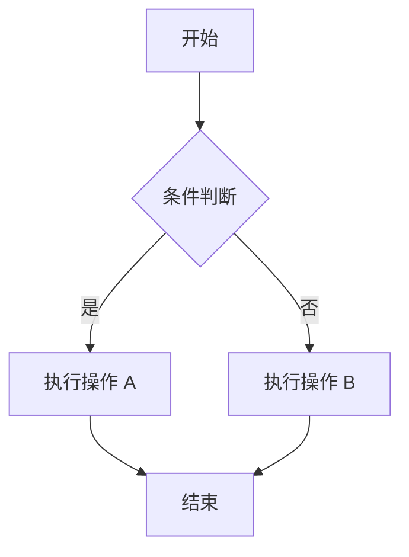
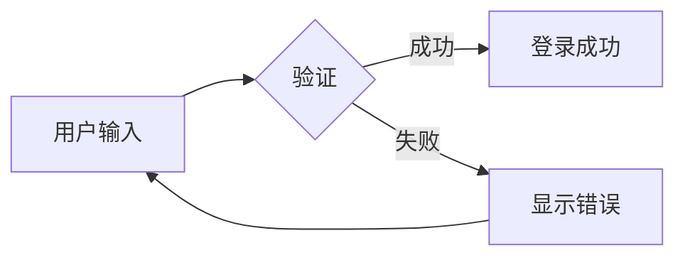
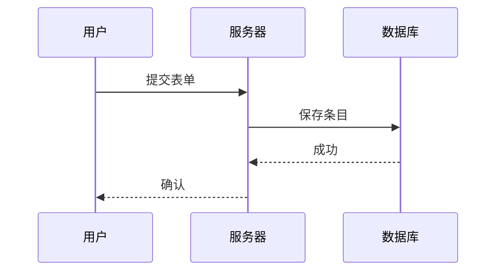
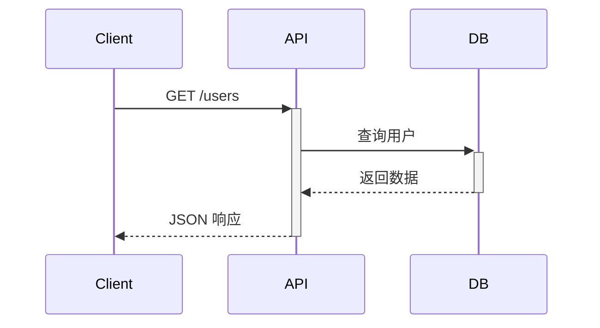
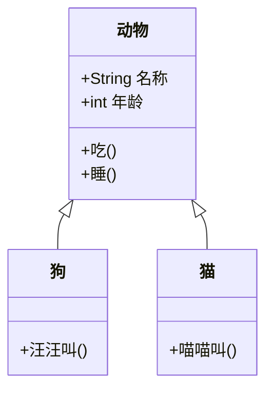
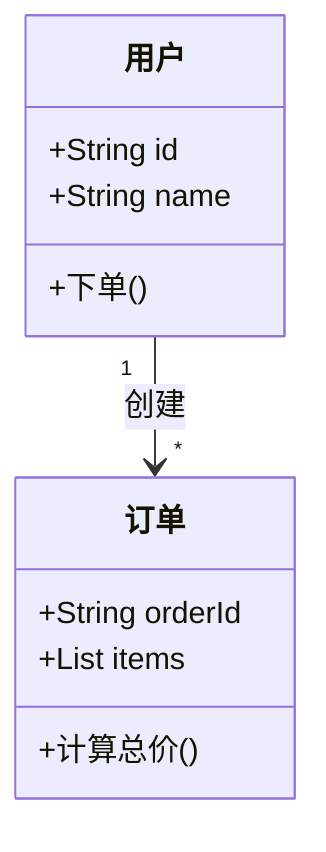
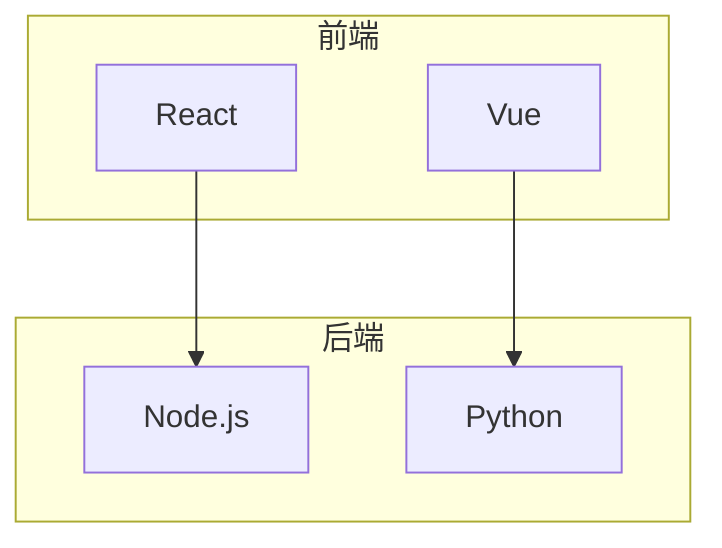
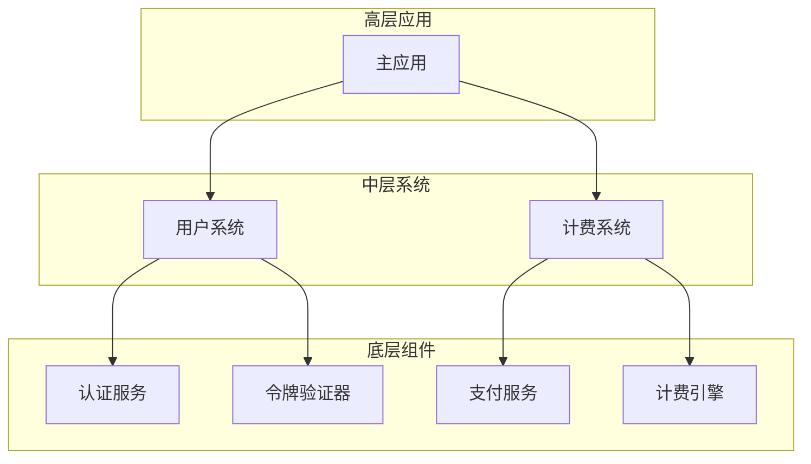

> 参考：[Cursor 文档 - Mermaid 图表](https://cursor.com/cn/docs/cookbook/mermaid-diagrams)

## 什么是 Mermaid

**Mermaid** 是一种基于 JavaScript 的图表和流程图工具，使用简单的文本语法在 Markdown 中创建图表。无需拖拽式编辑器，即可将代码转化为可视化，非常适合文档编写和版本控制。

### 核心优势

- **文本驱动**：图表即代码，易于版本管理和协作
- **Markdown 原生**：可直接在 `.md` 文件中使用
- **多种图表类型**：流程图、时序图、类图、甘特图等
- **Cursor 集成**：AI 可帮助你生成、优化和组合图表

---

## 为什么图示很重要

图示能澄清**数据如何流动**以及**组件如何交互**，在以下场景中尤为有用：

- 理解代码库中的**控制流**
- 追踪数据从输入到输出的**沿袭**
- 为他人**入职培训**或为系统编写**文档**
- **调试**时提出更有针对性的问题

可视化有助于你（以及 AI 模型）把握全局。

---

## 需要考虑的两个维度

| 维度     | 说明                                                   |
| -------- | ------------------------------------------------------ |
| **目的** | 你是在表示逻辑、数据流、基础设施，还是其他内容？       |
| **格式** | 你需要快速上手的（如 Mermaid）还是更正式的（如 UML）？ |

---

## Mermaid 常用图表类型

| 类型   | 关键字                  | 用途             |
| ------ | ----------------------- | ---------------- |
| 流程图 | `flowchart` / `graph`   | 表达逻辑与流程   |
| 时序图 | `sequenceDiagram`       | 展示交互过程     |
| 类图   | `classDiagram`          | 描述对象结构     |
| 有向图 | `graph TD` / `graph LR` | 绘制简单的有向图 |

---

## 示例 1：流程图 (Flowchart)

流程图由**节点**（几何形状）和**边**（箭头）组成。

### 基础语法

- **方向**：`TD`（自上而下）、`LR`（从左到右）、`TB`、`BT`、`RL`
- **节点形状**：`[]` 矩形、`()` 圆角、`{}` 菱形、`[[]]` 子程序等



### 用户登录流程



---

## 示例 2：时序图 (Sequence Diagram)

时序图展示多个参与者之间的**交互顺序**，常用于描述 API 调用、用户与系统交互等。



### API 请求流程



---

## 示例 3：类图 (Class Diagram)

类图用于描述**对象结构**、类之间的关系（继承、组合、聚合等）。



### 简单电商模型



---

## 示例 4：有向图 (Graph)

`graph` 是 `flowchart` 的简化版，适合绘制简单的层级或依赖关系。



### C4 模型风格的分层架构



---

## 在 Cursor 中使用 Mermaid

### 如何编写提示

从明确的目标开始，例如：

- **流程/控制流**：「告诉我请求如何从控制器流向数据库。」
- **数据沿袭**：「从进入到最终落点，追踪这个变量的路径。」
- **结构**：「给我这个服务的组件级视图。」

### 图示策略（C4 模型思路）

1. **从小处着手**：选择一个函数、路由或流程
2. **生成低层级图**：让 Cursor 使用 Mermaid 为该部分绘制图表
3. **逐步抽象**：概括为中层视图，再上升到高层概览
4. **合并图表**：将多个小图合并为系统地图

### 预览图表

安装 [Mermaid 扩展](https://marketplace.cursorapi.com/items?itemName=bierner.markdown-mermaid) 即可在 Markdown 中直接预览：

1. 打开「Extensions」选项卡
2. 搜索「Mermaid」并安装
3. 在 `.md` 文件中用 ` ```mermaid ` 包裹代码块即可渲染

---

## 要点总结

- 用图表理解**流程、逻辑和数据**
- 从小提示入手，**逐步扩展**你的图表
- 先从**低层级**开始，再逐步抽象到上层，类似 C4 模型

---

## 延伸阅读

- [Mermaid 官方文档](https://mermaid.js.org/)
- [Mermaid Live Editor](https://mermaid.live/) - 在线编辑与预览
