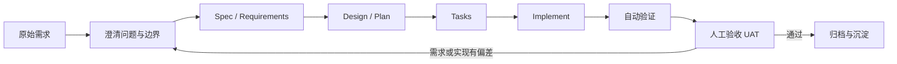

> 本文结合 TRAE 的《一文快速理解 Spec 模式》，并参考 GitHub Spec Kit 与 Kiro 的官方文档，对 Spec 模式进行系统梳理。

## 一、为什么 AI Coding 需要 Spec 模式

AI 编程最直接的使用方式，是向 Coding Agent 描述一个需求，然后让它立即读取代码、修改文件并运行命令。这种方式常被称为 **Vibe Coding**：开发者通过连续对话不断修正方向，AI 则根据当前上下文即时生成代码。

对于原型、小型功能和明确的局部修改，这种方式通常足够高效。但当任务规模扩大后，它容易出现以下问题：

- **缺乏全局视角**：单个文件看起来合理，但模块边界、类型设计和依赖关系可能逐渐失控。
- **上下文漂移**：对话越长，AI 越容易忘记最初的目标、约束和已确认决策。
- **需求被自行补全**：需求中没有明确说明的部分，AI 会根据常见做法进行猜测。
- **边界条件被遗漏**：主流程可以运行，但错误状态、空数据、权限、重试和兼容性处理不完整。
- **技术债快速累积**：缺少预先确认的设计与实施顺序，开发过程容易演变为不断打补丁。
- **决策难以追溯**：关键讨论留在聊天记录中，代码只能说明"最终做了什么"，不能说明"为什么这样做"。
- **团队协作困难**：其他成员可以看到代码，却看不到需求边界、设计权衡和验收依据。

这些问题并不完全是模型能力不足，而是因为复杂任务仅依赖会话上下文，没有一个稳定、可版本化、可检查的外部基准。

**Spec 模式的作用，就是把需求、约束、设计、任务和验收标准从对话中提取出来，变成项目里的长期工件。**

---

## 二、什么是 Spec 模式

`Spec` 是 `Specification` 的缩写，即规格说明或规范。

在 AI Coding 场景中，**Spec 模式是一套"先明确意图，再生成代码"的结构化开发流程**。Agent 不会在收到需求后立即开始实现，而是先与开发者共同建立一组可审查、可修改、可追踪的 Markdown 文档，再依据这些文档规划、编码和验证。

它的核心变化是：

```text
传统开发：代码是主要真相源
Vibe Coding：当前会话是主要真相源
Spec Coding：经过确认的意图与规格是主要真相源
```

因此，Spec 不是普通的背景资料，也不是一段写得很长的 Prompt，而是一组持续参与开发过程的 **Living Artifacts（活文档）**：

1. 开发前，它负责明确目标与边界；
2. 开发中，它负责约束 Agent 的执行范围；
3. 开发后，它负责判断结果是否完成；
4. 需求变化时，它需要同步更新，并继续驱动下一轮修改。

可以把 Spec 理解为三种角色的结合：

- **产品合同**：规定做什么、不做什么，以及什么结果才算完成；
- **工程施工图**：规定系统如何设计、任务如何拆解、先后依赖是什么；
- **验收基准**：规定需要运行哪些检查，并用什么证据证明功能成立。

---

## 三、Vibe、Plan 与 Spec 模式的区别

TRAE 文章将 AI Coding 的工作方式分为 Vibe、Plan 和 Spec 三个层级。它们没有绝对的高低之分，而是适用于不同复杂度的任务。

| 维度       | Vibe 模式                | Plan 模式                                    | Spec 模式                              |
| ---------- | ------------------------ | -------------------------------------------- | -------------------------------------- |
| 开始方式   | 描述需求后直接执行       | 先生成简短实施计划，再执行                   | 先澄清需求并建立完整规格，再分阶段执行 |
| 主要上下文 | 当前对话                 | 一份计划文档                                 | 需求、设计、任务、验收等结构化工件     |
| 人工介入   | 在执行过程中不断纠偏     | 开工前快速确认方向                           | 在需求、设计、任务和验收阶段设置确认点 |
| 适合场景   | 原型、文案、样式、小 Bug | 边界清晰的功能、模块级重构                   | 系统级功能、长周期项目、高风险变更     |
| 主要优势   | 启动快                   | 速度与可控性平衡                             | 全局一致、可追溯、可协作、可验收       |
| 主要风险   | 容易跑偏和返工           | 需求本身若不清晰，计划也可能建立在错误假设上 | 前期成本较高，维护不当会产生过期文档   |

### Plan 与 Spec 最本质的差别

二者的区别不只是"文档短或长"，而是它们解决的问题不同：

- **Plan 模式假设问题已经定义清楚**，重点是规划"如何完成"。
- **Spec 模式首先检查问题是否定义清楚**，然后再规划"如何完成"。

例如，"给现有设置页增加深色模式，沿用当前主题系统"通常适合 Plan；而"从零开发一个支持离线、后台同步、账号权限和多端一致性的 PWA"则需要先明确大量产品和技术决策，更适合 Spec。

一个实用判断标准是：

> 如果某个早期决策一旦错误，会导致多个模块返工，就应优先考虑 Spec 模式。

---

## 四、Spec 模式不是某一种固定文件格式

Spec-Driven Development 是方法论，不同工具会用不同的文件名和阶段实现它。

| 工具或流程           | 典型工件                                       | 侧重点                                   |
| -------------------- | ---------------------------------------------- | ---------------------------------------- |
| TRAE 文中介绍的 Spec | `spec.md`、`tasks.md`、`checklist.md`          | 项目范围、任务执行和最终验收             |
| Kiro Feature Specs   | `requirements.md`、`design.md`、`tasks.md`     | 需求、技术设计和实施任务三阶段           |
| GitHub Spec Kit      | Constitution → Spec → Plan → Tasks → Implement | 项目原则、需求规格、技术计划、任务与实现 |

这意味着，不应把某个工具的文件名当成唯一标准。无论使用什么工具，一套完整的 Spec 工作流通常都应覆盖以下四层信息：

1. **需求层：What / Why**  
   做什么、为什么做、谁使用、哪些内容不做、如何验收。

2. **设计层：How**  
   系统结构、模块职责、数据模型、接口、状态流转、风险和测试策略。

3. **执行层：Step by Step**  
   任务顺序、依赖关系、修改位置、完成条件和验证命令。

4. **验证层：Proof**  
   自动化测试、界面验证、日志、截图、性能数据、安全检查和人工验收。

TRAE 文章中的 `spec.md + tasks.md + checklist.md`，可以理解为把设计信息部分纳入 `spec.md`；Kiro 和 Spec Kit 则将技术设计或 Plan 单独拆出。二者本质上都在建立"需求—实现—验收"的闭环。

---

## 五、Spec 模式的完整工作流



### 阶段 0：建立项目级约束

在进入单个功能前，最好先向 Agent 提供项目长期约束，例如：

- 技术栈和版本范围；
- 目录结构与模块边界；
- 代码风格与命名规范；
- 测试要求；
- 性能、安全、兼容性要求；
- 禁止修改的公共 API；
- 不允许引入的依赖；
- 发布和回滚方式。

这些信息可以放在 `AGENTS.md`、`CLAUDE.md`、项目规则文件或 Spec Kit 的 `constitution.md` 中。它们负责回答"这个项目一贯怎样做"，而单次 Spec 负责回答"这次变更要做什么"。

### 阶段 1：需求澄清

不要急着让 AI 输出技术方案。首先要求它识别需求中的歧义、隐藏假设和待决策项。

至少需要回答：

- 为什么要做这个功能？
- 谁会使用？
- 用户在什么场景下使用？
- 正常流程是什么？
- 异常流程是什么？
- 哪些内容明确不在本次范围内？
- 是否涉及权限、隐私、费用、兼容性或数据迁移？
- 哪些行为必须保持不变？
- 什么结果才算完成？

复杂需求可以让 Agent 一次只追问一个高价值问题，直到关键分支全部收敛。AI 可以帮助暴露问题，但业务选择仍应由人确认。

### 阶段 2：生成并确认需求规格

需求规格应至少包含：

- 背景与问题；
- 目标；
- 用户与使用场景；
- 功能需求；
- 非功能需求；
- 非目标；
- 约束；
- 验收标准；
- 待确认问题；
- 修订记录。

验收标准必须可验证。避免使用"体验更好""速度足够快""界面美观"等无法客观判断的描述。

推荐使用稳定编号建立追踪关系：

```text
R1：用户可以提交联系表单。
R2：字段校验失败时，不得发送请求，并显示对应错误。
R3：邮件发送失败时，页面展示失败状态与重试入口。
R4：重复提交必须受到限制。
```

后续任务和测试可以直接引用 `R1`、`R2` 等编号。

### 阶段 3：生成技术设计或 Plan

需求规格回答"做什么"，技术设计负责回答"怎么做"。常见内容包括：

- 系统架构与模块划分；
- 组件职责；
- 数据模型；
- API 契约；
- 状态机与数据流；
- 错误处理和重试策略；
- 权限与安全方案；
- 性能与兼容性考虑；
- 测试策略；
- 备选方案与取舍；
- 发布、迁移和回滚方案。

设计文档应避免只写"使用某框架实现"这种结论，还应说明为什么选择它、它解决了什么问题，以及未选择其他方案的原因。

### 阶段 4：拆解 Tasks

任务列表不是把功能点重新抄一遍，而是把设计转换为 Agent 可以逐步执行的施工单。

一个合格任务应尽量包含：

- 对应的需求编号；
- 修改目标；
- 相关文件或模块；
- 前置依赖；
- 具体动作；
- 完成条件；
- 验证方式。

示例：

```md
- [ ] T3 实现联系表单 API，对应 R1、R2、R3
  - 文件：`src/api/contact.ts`、`src/services/mail.ts`
  - 依赖：T1、T2
  - 实现：校验输入、调用邮件服务、映射错误状态
  - 验证：运行单元测试与 API 集成测试
  - 完成标准：成功、参数错误、服务超时三类场景均有稳定响应
```

任务粒度应做到：Agent 可以独立执行，开发者可以独立检查。过大的任务会重新退化成模糊 Prompt；过小的任务则会带来不必要的流程负担。

### 阶段 5：按 Spec 执行

进入实现后，Agent 应遵守以下原则：

1. 按任务依赖顺序执行；
2. 每完成一个任务就更新状态；
3. 每个任务完成后立即运行局部验证；
4. 不擅自扩大范围；
5. 不进行与当前目标无关的重构；
6. 遇到未定义决策时暂停并回到 Spec，而不是自行猜测；
7. 发现原方案不可行时，先更新设计与任务，再继续写代码。

这里的关键不是让 Agent "绝对服从文档"，而是让任何偏离都变得显式、可讨论和可记录。

### 阶段 6：验证闭环

代码生成完成不等于需求完成。验证至少应覆盖：

- 编译或类型检查；
- Lint；
- 单元测试；
- 集成测试；
- 端到端测试；
- 页面主要交互；
- Loading、Empty、Error 等状态；
- 浏览器控制台和网络请求；
- 权限与安全边界；
- 性能或兼容性要求；
- 原有功能回归。

涉及 UI 时，不能只让 Agent 描述"页面正常"，而应要求提供可检查的证据，例如：

- 测试命令输出；
- 页面截图；
- Playwright 执行结果；
- 浏览器控制台日志；
- 关键接口响应；
- DOM 状态或性能指标。

自动验证通过后，仍需要由产品、开发或真实用户完成 UAT。AI 可以证明"实现符合文档"，但最终仍需要人判断"文档是否符合真实需求"。

### 阶段 7：变更与 Refine

Spec 不是一次生成后永久锁死的文档。需求变化时，应遵循：

```text
先修改 Spec / Requirements
→ 再调整 Design / Plan
→ 再更新 Tasks 与 Checklist
→ 最后修改代码
```

如果直接改代码而不更新 Spec，文档会迅速失真，下一次 Agent 读取它时反而会被错误信息误导。

---

## 六、TRAE 文章中的三份核心文档

在文章介绍的 TRAE 实现中，输入 `/spec` 后会生成三类文件，并保存在 `.trae/specs/<任务名称>/` 下。

```text
.trae/
└── specs/
    └── pwa-contact-form/
        ├── spec.md
        ├── tasks.md
        └── checklist.md
```

### 1. `spec.md`：范围与基准

它是当前需求的北极星文档，回答：

- 为什么做；
- 做什么；
- 不做什么；
- 关键决策是什么；
- 存在哪些约束；
- 什么结果算完成。

### 2. `tasks.md`：实施路线

它将范围拆成有顺序、可勾选、可检查的任务。Agent 在实现过程中更新完成状态，让开发者随时了解进度和剩余工作。

### 3. `checklist.md`：验收兜底

它用于检查是否存在遗漏，例如：

- 所有需求是否有对应实现；
- 所有异常状态是否处理；
- 必要测试是否通过；
- UI 是否真实验证；
- 是否出现范围外修改；
- 是否还存在已知风险。

与普通上传文档相比，这组三份文件不只是被动参考资料，而是 Agent 的主动执行依据：它们参与任务拆解、进度追踪、范围纠偏和最终验收。

---

## 七、可直接复用的 Spec 模板

### `spec.md`

```md
# Feature Spec：<功能名称>

## 1. 背景

描述当前问题、业务背景和现状。

## 2. 目标

- G1：
- G2：

## 3. 用户与场景

- 用户角色：
- 核心场景：

## 4. 范围

### 4.1 本次包含

-

### 4.2 本次不包含

-

## 5. 功能需求

- R1：
- R2：

## 6. 非功能需求

- 性能：
- 安全：
- 兼容性：
- 可观测性：

## 7. 约束

- 技术约束：
- 依赖约束：
- 禁止修改内容：

## 8. 验收标准

- AC1：
- AC2：

## 9. 已确认决策

| 决策 | 结论 | 原因 |
| ---- | ---- | ---- |
|      |      |      |

## 10. 待确认问题

- [ ] Q1：

## 11. 修订记录

| 日期 | 修改内容 | 修改人 |
| ---- | -------- | ------ |
|      |          |        |
```

### `design.md` 或 `plan.md`

```md
# Technical Design：<功能名称>

## 1. 方案概览

## 2. 现有系统分析

## 3. 架构与模块

## 4. 数据模型

## 5. API 契约

## 6. 状态与数据流

## 7. 错误处理

## 8. 安全与权限

## 9. 测试策略

## 10. 发布、迁移与回滚

## 11. 备选方案与取舍

## 12. 已知风险
```

### `tasks.md`

```md
# Tasks：<功能名称>

## 阶段 1：基础结构

- [ ] T1 <任务名称>，对应 R1
  - 文件：
  - 依赖：无
  - 动作：
  - 验证：
  - 完成标准：

## 阶段 2：核心实现

- [ ] T2 <任务名称>，对应 R2、R3
  - 文件：
  - 依赖：T1
  - 动作：
  - 验证：
  - 完成标准：

## 阶段 3：集成与回归

- [ ] T3 <任务名称>
```

### `checklist.md`

```md
# Acceptance Checklist：<功能名称>

## 需求覆盖

- [ ] 每条需求均有对应实现
- [ ] 每条需求均有对应验证方式
- [ ] 非目标内容未被额外实现

## 功能验证

- [ ] 正常流程通过
- [ ] 空状态通过
- [ ] 错误状态通过
- [ ] 重试流程通过
- [ ] 权限边界通过

## 工程质量

- [ ] 类型检查通过
- [ ] Lint 通过
- [ ] 单元测试通过
- [ ] 集成测试通过
- [ ] E2E 测试通过
- [ ] 无新增高优先级控制台错误

## 交付

- [ ] 文档已同步更新
- [ ] 已知风险已记录
- [ ] 回滚方式明确
- [ ] 人工 UAT 已通过
```

---

## 八、文章中 PWA 联系表单场景的 Spec 示例

原文使用了一个"带后端邮件发送功能的 PWA"作为示例。将一句模糊需求：

```text
做一个可以提交联系表单并发送邮件的 PWA。
```

转换成 Spec 后，可以得到更明确的范围。

### 需求摘要

```md
## 目标

用户可以在手机或桌面端打开可安装的 PWA，填写联系表单并将内容发送到指定邮箱。

## 本次包含

- 姓名、邮箱、主题、正文输入
- 客户端与服务端字段校验
- 后端邮件发送 API
- 使用 Resend 发送邮件
- 提交中、成功、失败状态
- 基础频率限制
- PWA 安装能力和静态页面离线访问

## 本次不包含

- 用户账号系统
- 邮件模板后台
- CRM 集成
- 离线状态下缓存并延迟发送表单
- 多收件人配置界面

## 验收标准

- R1：字段合法且邮件服务正常时，提交后目标邮箱能够收到邮件。
- R2：字段不合法时，不调用发送接口，并在对应字段附近显示错误。
- R3：邮件服务失败时，页面展示失败信息并允许重试。
- R4：提交过程中按钮不可重复点击。
- R5：应用满足基本 PWA 安装条件，离线时仍可打开静态表单页面。
```

### 任务摘要

```md
- [ ] T1 初始化前端与 PWA 配置
- [ ] T2 实现联系表单组件和客户端校验
- [ ] T3 实现后端联系表单 API
- [ ] T4 集成 Resend 邮件服务
- [ ] T5 增加频率限制和错误映射
- [ ] T6 编写单元测试与 API 集成测试
- [ ] T7 使用浏览器验证安装、在线提交和异常状态
```

### 验收摘要

```md
- [ ] 合法表单能够发送邮件
- [ ] 非法邮箱被前端和服务端同时拒绝
- [ ] 重复提交受到限制
- [ ] 邮件服务异常时不会显示成功状态
- [ ] PWA 可以安装
- [ ] 离线时静态页面可以打开
- [ ] 测试、Lint 和类型检查通过
```

通过这种方式，前端框架、Service Worker、后端 API、邮件供应商、失败状态和离线边界都在编码前得到明确，Agent 不需要在实现过程中擅自补全关键决策。

---

## 九、什么时候应该使用 Spec 模式

### 推荐使用

- 从零开始开发一个完整应用；
- 新功能跨越多个模块或仓库；
- 涉及数据库、接口或公共类型变更；
- 涉及权限、支付、隐私、安全或数据迁移；
- 存在多个可行技术方案，需要先做取舍；
- 任务会持续数天或跨多个会话；
- 需要多人或多个 Agent 协作；
- 需要保留审计、合规或决策记录；
- 错误的早期设计会引发大范围返工；
- 验收标准复杂，不能仅凭"代码能运行"判断完成。

### 不必使用完整 Spec

- 修改一句文案；
- 调整一个局部样式；
- 修复原因和边界都已经明确的小 Bug；
- 重命名变量或做机械性清理；
- 一次性的探索原型；
- 修改范围极小且失败成本很低的任务。

可以采用渐进策略：

```text
简单且明确 → Vibe
范围明确但步骤较多 → Plan
范围复杂、长期或高风险 → Spec
```

---

## 十、让 Spec 真正有效的实践原则

### 1. 明确写出非目标

很多范围膨胀不是因为"做什么"没写清楚，而是"这次不做什么"没有写清楚。非目标能够显著减少 Agent 自作主张和过度设计。

### 2. 将需求与实现分开

需求阶段先描述用户行为、业务规则和验收标准，不要过早锁定框架和类名。技术选型应进入 Design 或 Plan，除非它本身就是硬性约束。

### 3. 使用可验证的语言

推荐写法：

```text
WHEN 用户提交无效邮箱
THE SYSTEM SHALL 阻止发送并显示邮箱格式错误
```

不推荐写法：

```text
系统要友好地处理错误。
```

### 4. 建立需求—任务—测试追踪

为需求、任务和测试使用稳定编号：

```text
R3 → T5 → TEST-API-07
```

这样可以快速发现某条需求是否没有任务，或者某个任务是否没有验证。

### 5. 每个任务都附带验证

不要把所有测试堆到最后。任务完成后立即验证，能够更早定位错误来源，并减少多项改动叠加后的排查成本。

### 6. 对每个阶段进行 Review

Agent 生成的第一版 Spec 只是草稿。应分别审查：

- 需求是否存在歧义；
- 设计是否过度复杂；
- 任务是否完整且顺序合理；
- 验收是否能证明真实功能成立。

### 7. 将 Spec 纳入 Git

Spec 应与代码一起版本管理，以便：

- 追踪需求和设计变化；
- 在代码评审中同时评审意图；
- 为后续维护者保留背景；
- 在 Agent 更换或上下文重建时快速恢复状态。

### 8. 需求变化时先更新文档

Spec 的价值依赖于"文档与代码一致"。如果需求改变后只修改代码，Spec 很快就会失去可信度。

### 9. 使用证据而不是完成声明

"已经完成"不应仅由 Agent 自己判断。应要求它提供命令输出、测试结果、截图、日志或其他可复核证据。

### 10. 保留人工最终决策权

AI 可以帮助分析需求、生成方案、执行任务和进行自动验证，但产品取舍、架构边界、风险接受和最终验收仍需要人负责。

---

## 十一、常见误区

### 误区 1：Spec 就是更长的 Prompt

长 Prompt 仍然可能只存在于当前会话中。真正的 Spec 需要结构化、可版本化，并参与后续任务和验收。

### 误区 2：文档越多越专业

Spec 的目标是降低歧义，而不是制造文档。简单任务使用完整流程，可能让沟通成本高于开发成本。

### 误区 3：第一版 Spec 可以直接执行

AI 会补全隐藏假设，也可能遗漏真实业务规则。第一版更适合作为问题清单和讨论起点。

### 误区 4：有了 Spec 就不需要 Review

Spec 只能减少随机性，不能保证需求正确、设计合理或代码没有缺陷。它不会替代代码评审、安全审查和人工测试。

### 误区 5：Tasks 只需要列功能名称

"实现登录""完成接口""增加测试"仍然过于模糊。任务必须说明范围、位置、依赖、结果和验证方法。

### 误区 6：代码与 Spec 不一致时以代码为准

若团队采用 Spec-Driven Development，应先判断哪一方代表真实意图；确认后同步修订另一方，而不是长期容忍二者分叉。

### 误区 7：Checklist 只是交付前补写

验收清单应在实现前确定。否则 Agent 很容易先按自己的理解完成代码，再反向挑选能够通过的验收项。

---

## 十二、Spec 模式的局限

Spec 模式能显著提升复杂任务的稳定性，但它不是万能方案：

- 前期需要投入时间澄清需求和审查文档；
- 需求高速变化时，维护 Spec 可能成为额外负担；
- 过度详细的规格会产生虚假的确定性；
- Agent 仍可能误读规格或实现错误；
- 文档过期后会比没有文档更危险；
- 技术探索类任务可能无法在开始时形成完整规格；
- 最终质量仍取决于模型能力、上下文质量、工程环境和人工 Review。

因此，Spec 应被视为一种 **复杂度管理和协作机制**，而不是代码质量的自动保证。

---

## 十三、总结

Spec 模式的价值，不是让 AI 写更多文档，而是把原本散落在聊天中的意图转化为可执行、可检查、可追踪的工程资产。

它建立了这样一条链路：

```text
明确需求
→ 固化边界
→ 形成设计
→ 拆解任务
→ 按顺序实现
→ 用证据验证
→ 根据反馈更新规格
```

对于简单需求，直接 Prompt 或 Plan 往往更高效；对于复杂、长期、高风险的开发任务，Spec 能够充当 Agent 的长期锚点，减少上下文漂移、范围膨胀和后期返工。

AI 越擅长连续执行，开发者越需要提前把方向、边界和完成标准表达清楚。人的角色并没有消失，而是从逐行编写代码，进一步前移到需求判断、方案决策、风险控制和最终验收。

---

## 参考资料

1. [zhuanlan.zhihu.com/p/2010770331212731105](https://zhuanlan.zhihu.com/p/2010770331212731105)
2. [developer.volcengine.com/articles/7611740678360662022](https://developer.volcengine.com/articles/7611740678360662022)
3. [github.com/github/spec-kit](https://github.com/github/spec-kit)
4. [github.github.com/spec-kit](https://github.github.com/spec-kit/)
5. [kiro.dev/docs/specs](https://kiro.dev/docs/specs/)
6. [kiro.dev/docs/specs/feature-specs](https://kiro.dev/docs/specs/feature-specs/)
