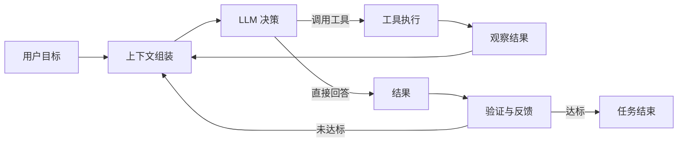
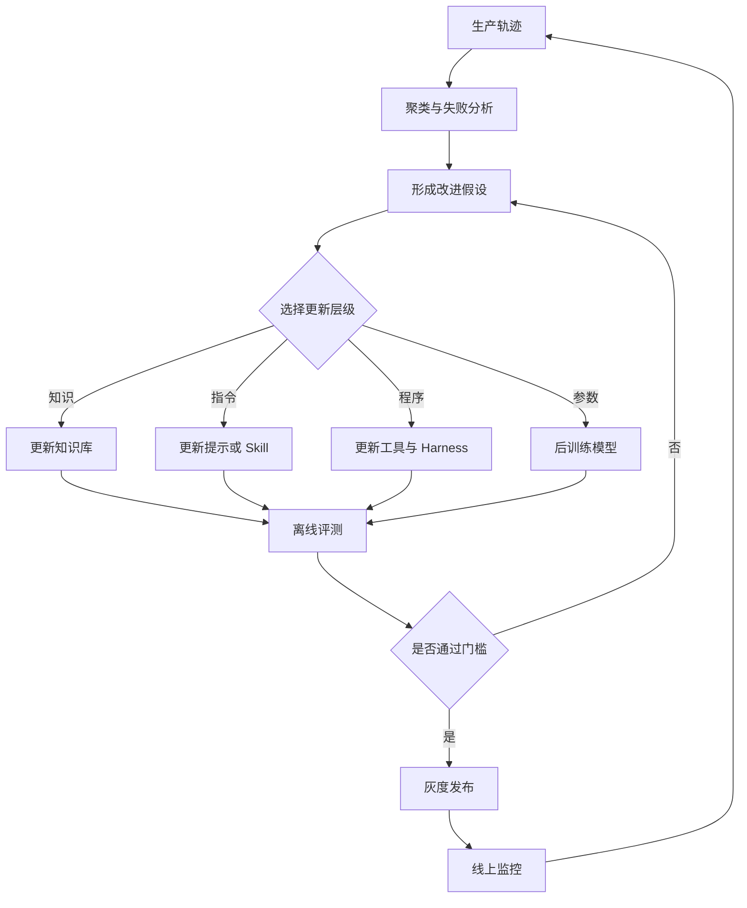
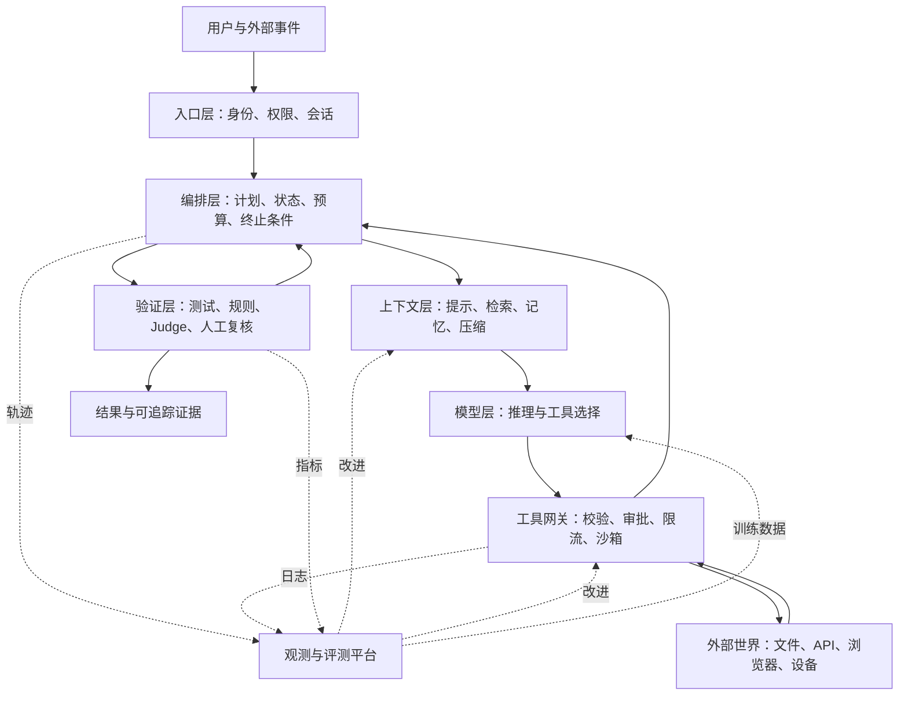

> 本文是对开源书籍 [《深入理解 AI Agent：设计原理与工程实践》](https://github.com/bojieli/ai-agent-book) 的学习整理与工程化解读。它不是逐章摘要，而是围绕一个问题重新组织内容：**怎样把一个“会回答问题”的大模型，建设成一个能够可靠完成任务的 Agent 系统？**

## 一、先给出结论：Agent 不是模型，而是一个闭环系统

最简洁的定义是：

> **Agent = LLM + 上下文 + 工具。**

LLM 负责理解、推理和决策；上下文提供当前任务所需的可见状态；工具让模型能够读取外部世界并对它采取行动。三者通过一个持续运行的循环连接起来：模型观察环境、选择动作、接收结果，再决定下一步。



这一区分很重要。模型能力决定系统的潜在上限，但真正决定实际表现的，往往是模型之外的 **Harness 工程**：提示词如何组织、哪些信息进入上下文、工具接口是否清晰、循环何时停止、错误怎样恢复、结果如何验证，以及高风险操作是否需要审批。

因此，做 Agent 的核心工作已经从单纯的 Prompt Engineering，转向对整个执行循环的 **Loop Engineering**。

## 二、Agent 的基本单元：ReAct 循环

Agent 最常见的运行方式可以抽象为 ReAct：根据当前观察进行推理，然后采取行动，再把行动结果作为新的观察。

一个极简循环大致如下：

```python
messages = [system_prompt, user_request]

for step in range(MAX_STEPS):
    response = model.generate(messages, tools=tool_schemas)
    messages.append(response)

    if not response.tool_calls:
        return response.text

    for call in response.tool_calls:
        result = execute_tool(call.name, call.arguments)
        messages.append(tool_result(call.id, result))

raise RuntimeError("Agent exceeded the step limit")
```

这段代码很短，却隐藏了生产系统里最难的部分：

- `system_prompt` 是否清楚定义了目标、约束和行为边界；
- `tool_schemas` 能否让模型准确理解工具能力；
- `execute_tool` 是否具备权限隔离、超时、重试和幂等机制；
- 工具返回值是否保留了足够信息，又没有污染上下文；
- `MAX_STEPS`、预算和截止时间如何共同控制循环；
- 最终输出是模型“自称完成”，还是经过外部验证后真正完成。

所以，能跑起来的 Agent 只需要一个循环，能稳定运行的 Agent 却需要一整套控制面。

## 三、Harness 工程：把模型能力转化为任务成功率

可以把 Agent 的 Harness 拆成五类职责：

| 职责       | 关键问题               | 常见工程手段                                   |
| ---------- | ---------------------- | ---------------------------------------------- |
| 上下文管理 | 模型此刻应该看到什么？ | 分层提示、检索、摘要、状态栏、上下文隔离       |
| 工具编排   | 模型能够做什么？       | JSON Schema、权限控制、超时、重试、异步事件    |
| 循环控制   | 何时继续，何时停止？   | 步数、Token、成本、时间预算与终止条件          |
| 可靠性保障 | 出错后怎样恢复？       | 检查点、幂等操作、回滚、人工审批、沙箱         |
| 评测与观测 | 系统真的变好了吗？     | 轨迹日志、任务集、自动验证、消融实验、A/B 测试 |

这些部分相互制约。例如，把更多信息塞进上下文，可能提高单步判断质量，却会增加延迟和成本，还会破坏 Prompt Cache；把工具做得过于细碎，虽然容易复用，却会拉长轨迹并增加选错工具的概率；赋予 Agent 更大权限可以提高自主性，同时也扩大错误的影响半径。

工程设计的目标不是让 Agent “尽可能自主”，而是让它在给定风险和成本约束下，取得更高的端到端任务成功率。

## 四、上下文工程：管理模型在当前一步所能看到的世界

上下文不等于聊天记录。对于 Agent，它更像运行时内存，通常由以下内容组成：

1. 系统规则与身份；
2. 用户目标、验收标准和当前指令；
3. 工具定义与使用约束；
4. 任务状态、执行计划和预算；
5. 历史消息、工具调用与观察结果；
6. 从文件、知识库或外部系统按需检索的资料；
7. 对过长轨迹进行压缩后留下的摘要。

### 1. 稳定前缀，动态后缀

许多模型服务会对相同的提示前缀复用 Prompt Cache。因而，稳定的系统规则、工具定义和通用说明应尽量放在前部；频繁变化的时间、任务进度和检索结果应靠后放置。

这不是排版偏好，而是架构约束。若把每轮都会变化的状态写在最前面，后续大段相同内容也可能无法命中缓存，直接推高延迟与成本。

### 2. 流程优于规则堆砌

系统提示词如果只是不断追加“不要做什么”，很快会变成相互冲突的规则集合。更稳健的写法是围绕工作流程组织：先理解目标，再检查环境；先读取，再修改；修改后执行验证；高风险动作必须获得批准；无法验证时明确说明不确定性。

模型更容易遵循一条可执行路径，而不是在几十条平铺规则中自己推导优先级。

### 3. 压缩不是简单总结

长任务迟早会遇到上下文上限。有效压缩需要保留对未来决策有用的状态，例如：

- 当前目标和不可违反的约束；
- 已确认的事实与证据来源；
- 已执行操作及其结果；
- 失败过的方案与失败原因；
- 尚未完成的步骤；
- 关键文件、对象标识和依赖关系。

一段读起来流畅的摘要，不一定是好的 Agent 状态。若它丢失了失败历史，Agent 可能反复尝试同一条错误路径；若丢失了验收标准，后续步骤可能优化了局部结果，却偏离用户目标。

### 4. 隔离有时优于压缩

当任务包含彼此独立的研究、编码或分析分支时，可以把它们交给上下文隔离的子 Agent。主 Agent 只接收结构化结论，而不继承每个分支的完整轨迹。这样既减少上下文污染，也降低不同任务规则互相干扰的概率。

但拆分并非免费：需要定义清晰的任务边界、交付格式和合并机制。若两个子任务会同时修改同一文件或依赖同一份可变状态，多 Agent 反而可能增加协调成本。

## 五、工具设计：给 Agent 一组可理解、可控制的动作

工具不仅是一个可调用函数，它同时是一份写给模型看的能力契约。一个好的工具需要回答四个问题：它做什么、什么时候使用、需要什么参数、会返回什么结果。

### 1. 工具粒度

过于宽泛的工具，例如 `run_anything(command)`，能力强但风险高，模型也难以预判副作用。过于细碎的工具，则会让一个简单任务需要几十次调用，放大延迟和错误率。

合适的粒度通常对应一个有清楚语义、结果可验证、失败可处理的业务动作。例如，“创建订单草稿”通常比“执行任意数据库语句”更安全，也比“分别写入订单表的每个字段”更高效。

### 2. 描述和参数

工具名和描述应说明适用边界，而不只是复述函数名。参数应使用明确类型、枚举、格式和必填项，避免让模型猜测单位、日期格式或对象标识。

尤其要保持参数保真：模型生成的结构化参数，应经过严格校验后传给工具；系统不要在中间做难以观测的隐式改写，否则错误会变得难以定位。

### 3. 返回值

只返回“成功”通常不够。Agent 可能还需要对象 ID、实际变更、警告信息、版本号或下一步可用的操作。反过来，把完整网页、长日志和二进制内容原样塞回上下文，也会造成噪声。

理想返回值应该包含：简短状态、关键结构化数据、可追踪证据，以及必要时获取完整结果的引用。

### 4. 安全边界

工具层需要执行模型无法可靠自我约束的硬规则：

- 最小权限与作用域限制；
- 输入校验和输出过滤；
- 超时、限流和资源配额；
- 写操作的幂等键；
- 高风险动作的人工确认；
- 沙箱、审计日志与可回滚机制；
- 把网页、邮件等外部内容视为不可信数据，防范提示注入。

一句写在提示词里的“不要删除生产数据”，不能替代工具端真正禁止删除的权限控制。

## 六、记忆、知识库与当前上下文是三件不同的事

这三个概念经常被混在一起：

| 类型       | 回答的问题                       | 典型内容                           |
| ---------- | -------------------------------- | ---------------------------------- |
| 当前上下文 | 这一步需要知道什么？             | 当前目标、最近工具结果、任务状态   |
| 用户记忆   | 关于这个用户，未来还应记住什么？ | 偏好、长期项目、稳定约束、历史决策 |
| 知识库     | 外部世界有哪些可检索事实？       | 产品文档、制度、代码、研究资料     |

用户记忆的难点不是“存下来”，而是决定何时写入、怎样更新、何时遗忘，以及如何防止把模型猜测当成用户事实。比较稳妥的做法是把记忆分层：原始事件只作短期保留；经过确认的稳定事实进入长期记忆；可推断偏好带上置信度和证据；敏感信息则默认不存储或先做脱敏。

知识库侧的基础流程仍是分块、索引、检索和重排，但 Agentic RAG 与传统“检索一次再回答”不同。Agent 可以先判断缺少什么信息，再选择检索工具，分析结果后继续发起更精确的查询，最终基于证据完成任务。

检索因此从一个固定前置步骤，变成了循环中的一种可选择动作。

## 七、为什么 Coding Agent 是通用 Agent 的重要原型

代码具有几项特殊优势：表达精确、可以执行、能够组合，并且容易通过测试验证。这使 Coding Agent 成为观察完整 Agent 工程的理想场景。

一个成熟的 Coding Agent 通常执行这样的链路：

```text
理解任务
→ 搜索仓库与读取约束
→ 建立修改计划
→ 编辑少量相关文件
→ 运行测试、检查或构建
→ 根据错误继续修复
→ 审查差异
→ 总结结果与剩余风险
```

其中，搜索和编辑工具的设计会直接改变 Agent 行为。快速文本搜索让模型能够先定位证据再读取文件；补丁式编辑能减少意外覆盖；编译器、测试和静态检查则构成外部反馈，使模型不必完全依赖自己的判断。

更广义地看，代码还是通用 Agent 的“元工具”：它可以临时处理数据、连接 API、转换文件、生成界面，甚至创造新的工具。不过这也意味着代码执行必须置于隔离环境，限制网络、凭据、文件系统和运行资源。

## 八、评测：不要问“回答好不好”，要问“任务是否真的完成”

Agent 的评测对象不是一段文本，而是完整轨迹及其最终环境状态。

### 1. 任务集

高质量评测任务应具有明确目标、可控初始状态、客观验收方式，并覆盖真实使用中的难度与失败模式。只收集模型擅长的短任务，会得到漂亮却无用的分数。

### 2. 指标

至少应同时观察：

- **结果质量**：最终状态是否满足验收条件；
- **轨迹质量**：是否绕路、重复调用或执行危险操作；
- **效率**：Token、工具调用次数、耗时与实际成本；
- **可靠性**：重复运行的方差、超时率与失败分布；
- **安全性**：越权、提示注入、隐私泄露和不可逆操作；
- **人机协作**：是否在正确时机请求信息或审批。

对于能编译、查询或检查环境状态的任务，应优先使用确定性验证器。LLM-as-a-Judge 适合评估表达质量、开放式研究和多维偏好，但需要校准，并警惕位置偏差、风格偏好和“说得像成功”被误判为真正成功。

### 3. 从观测到改进

生产环境需要记录结构化轨迹：模型版本、提示词版本、工具参数、返回状态、耗时、Token、错误、人工接管点和最终结果。只有这样，团队才能把“Agent 有时不太稳定”转化为可以验证的假设。

改进后还要做消融实验：如果同时更换模型、重写提示词并新增工具，即使成功率上升，也无法知道究竟是哪项改动有效。Agent 工程需要像其他系统工程一样，使用版本、特性开关、回放集和 A/B 测试建立因果证据。

## 九、从评测到持续进化

当系统积累了大量运行轨迹，可以从成功和失败中提炼经验。按照改动深度，经验大致有四种沉淀方式：

1. **写入知识**：补充事实、案例和故障记录；
2. **写入指令**：更新提示词、Skill 或工作流程；
3. **写入程序**：修复工具、验证器或编排逻辑；
4. **写入参数**：通过 SFT、偏好优化或强化学习改变模型。

越往后，成本、验证难度和影响范围通常越大。因此应先选择最小但足够有效的更新方式。一个能通过修正工具描述解决的问题，没有必要立即训练模型。



所谓“持续进化”不能等同于让 Agent 自行修改自己并立即上线。可靠闭环必须包含数据筛选、隐私处理、离线验证、灰度发布、回滚和人工治理。否则系统不仅会学习成功经验，也可能把偶然策略、错误结论甚至攻击内容固化下来。

## 十、多模态与实时 Agent：动作空间开始进入物理世界

语音、图形界面和机器人让 Agent 的观察与动作不再局限于文本 API。

语音 Agent 需要在识别准确率、响应延迟、打断处理和自然表达之间取舍。Computer Use Agent 则要解决视觉定位、界面变化、动态内容与操作反馈。机器人系统还必须面对连续控制、传感器噪声、实时性和 Sim2Real 差异。

这类系统常采用分层设计：上层模型负责理解目标和长程规划，下层专用模块负责低延迟感知与控制。原因很直接：擅长复杂推理的大模型，未必适合以高频率稳定输出电机控制信号。

当 Agent 可以操作真实账户、浏览器或硬件时，验证和护栏也必须升级。文本回答出错可能只影响一次对话，真实动作出错则可能造成资金、数据或人身风险。

## 十一、多 Agent：只有在隔离收益大于协调成本时才值得使用

多 Agent 不是“多开几个模型就会更聪明”。它主要在三类场景中有价值：

- 可并行的独立子任务，例如分别研究多个候选方案；
- 需要不同上下文或专业角色，避免一条轨迹承载所有信息；
- 需要相互审查、辩论或独立验证，以降低单一路径偏差。

常见拓扑包括：

- **管理者模式**：主 Agent 分解任务、分配工作并合并结果；
- **对等协作**：多个 Agent 相互审查和迭代；
- **去中心化移交**：当前 Agent 根据状态把任务交给下一位；
- **共享上下文的角色转换**：同一轨迹在规划者、执行者和审查者之间切换。

多 Agent 的主要失败也很典型：同时修改共享文件产生冲突；上游 Agent 的错误被下游当作事实继续放大；工作重复；通信成本超过并行收益；责任边界不清导致无人验证最终结果。

因此，在引入多 Agent 前，应先回答：任务真的能独立拆分吗？每个子任务是否有明确输入输出？共享状态由谁拥有？冲突怎样处理？谁对最终结果负责？如果这些问题没有答案，单 Agent 加确定性工作流往往更可靠。

## 十二、一个生产级 Agent 的参考架构

综合前面的原则，可以得到一套分层架构：



这套架构背后的核心思想是：模型只负责它擅长的概率性判断，而权限、资源限制、状态一致性和最终验证尽可能由确定性系统承担。

## 十三、落地时最容易踩的坑

### 1. 只升级模型，不修 Harness

更强模型可能暂时掩盖工具描述不清、上下文污染和验证缺失，但不会自动消除这些系统问题。模型升级前后都应在同一任务集上比较端到端结果。

### 2. 把“模型说完成了”当作完成

真正的完成应由环境状态证明：测试通过、文件存在、数据库记录正确、消息已发送，或者人工已经确认。

### 3. 无限制地增加工具

工具数量越多，选择难度和上下文成本越大。应按需发现、分组加载，或通过 Skill 在需要时再注入领域工具和规则。

### 4. 长期记忆只写不删

过期偏好和历史事实会持续污染后续决策。记忆系统需要来源、时间、置信度、更新和遗忘机制。

### 5. 用平均分掩盖关键失败

总体成功率可能上升，但删除数据、越权访问等低频严重事故仍不可接受。安全指标应设置单独门槛，而不能被其他维度的高分抵消。

### 6. 为了“智能”而使用多 Agent

如果任务本来是串行且共享状态密集，多 Agent 会把执行问题变成分布式系统问题。先验证并行或隔离的收益，再增加协作拓扑。

## 十四、工程检查清单

在把 Agent 交给真实用户前，至少确认以下问题：

- 目标和验收标准是否明确、可验证？
- 上下文中哪些内容稳定，哪些内容需要按需加载？
- 工具的适用边界、参数和返回值是否足够清楚？
- 写操作是否幂等，高风险动作是否需要审批？
- 是否有步数、时间、Token、成本和资源上限？
- 工具失败、网络中断和模型输出异常时能否恢复？
- 最终结果是否由独立验证器或人工复核确认？
- 是否记录了足够的轨迹用于定位问题，但没有泄露敏感信息？
- 评测集是否覆盖真实任务、长尾情况和安全风险？
- 更新提示词、工具或模型后，是否做过回归和消融验证？
- 长期记忆是否支持纠正、过期和删除？
- 多 Agent 是否有清楚的所有权、通信协议和冲突处理规则？

## 结语

AI Agent 的关键突破，不只是模型学会了调用函数，而是软件系统开始围绕模型建立完整的观察—决策—行动—验证闭环。

从工程角度看，最值得记住的不是某个框架名称，而是四条原则：

1. **把模型视为系统组件，而不是整个系统；**
2. **把上下文当作稀缺的运行时状态来管理；**
3. **把工具调用置于明确的权限、预算与验证边界内；**
4. **用真实任务和可追踪轨迹驱动持续改进。**

最终，优秀的 Agent 不应只是“看起来很聪明”，而应该能够在现实约束下可靠行动：知道自己要完成什么，能获得必要信息，能使用合适工具，能从结果中修正路线，并且有证据证明任务确实完成。

---

## 参考资料

- Bojie Li 等：[《深入理解 AI Agent：设计原理与工程实践》](https://github.com/bojieli/ai-agent-book)，本文参考版本为提交 [`984aeef`](https://github.com/bojieli/ai-agent-book/tree/984aeef3573ce8a3b74140feb0166541b8cf96c3)。
- [第 1 章：AI Agent 入门](https://github.com/bojieli/ai-agent-book/blob/984aeef3573ce8a3b74140feb0166541b8cf96c3/book/chapter1.md)
- [第 2 章：上下文工程](https://github.com/bojieli/ai-agent-book/blob/984aeef3573ce8a3b74140feb0166541b8cf96c3/book/chapter2.md)
- [第 3 章：用户记忆和知识库](https://github.com/bojieli/ai-agent-book/blob/984aeef3573ce8a3b74140feb0166541b8cf96c3/book/chapter3.md)
- [第 4 章：工具](https://github.com/bojieli/ai-agent-book/blob/984aeef3573ce8a3b74140feb0166541b8cf96c3/book/chapter4.md)
- [第 5 章：Coding Agent 与代码生成](https://github.com/bojieli/ai-agent-book/blob/984aeef3573ce8a3b74140feb0166541b8cf96c3/book/chapter5.md)
- [第 6 章：Agent 的评估](https://github.com/bojieli/ai-agent-book/blob/984aeef3573ce8a3b74140feb0166541b8cf96c3/book/chapter6.md)
- [第 7 章：模型后训练](https://github.com/bojieli/ai-agent-book/blob/984aeef3573ce8a3b74140feb0166541b8cf96c3/book/chapter7.md)
- [第 8 章：Agent 的持续进化](https://github.com/bojieli/ai-agent-book/blob/984aeef3573ce8a3b74140feb0166541b8cf96c3/book/chapter8.md)
- [第 9 章：多模态与实时交互](https://github.com/bojieli/ai-agent-book/blob/984aeef3573ce8a3b74140feb0166541b8cf96c3/book/chapter9.md)
- [第 10 章：多 Agent 协作](https://github.com/bojieli/ai-agent-book/blob/984aeef3573ce8a3b74140feb0166541b8cf96c3/book/chapter10.md)

> 原书以 Apache License 2.0 发布。本文为重新组织和表述的学习笔记，建议结合原书章节与配套实验阅读。
